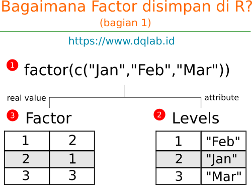
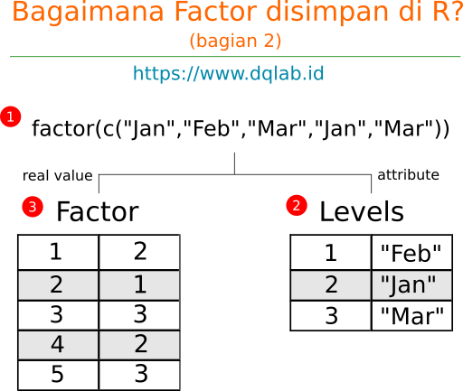

# Apa itu Data Preparation atau Data Wrangling?
> "Data preparation accounts for about 80% of the work of data scientists"


> Data wrangling adalah proses membaca data dari berbagai sumber dan merubah isi dan struktur sehingga dapat digunakan untuk analisa.

## Tiga Tahapan Penting dalam Pengolahan Data

1. Capture
    Mengumpulkan data mentah
2. Clean
    Membersihkan & merapikan data
3. Consume
    Mengkonsumsi hasil visualisasi data yang telah dibersihkan.
    Biasanya berupa data dashboard.

# Missing Value in R


+ Bagaimana missing value direpresentasikan, ini penting sehingga kita bisa identifikasi apakah nilai hilang karena dari awal memang ga ada, apakah karena operasi matematika, dan lain-lain.
+ Dengan mengetahui representasi ini, kita dapat melakukan sesuatu terhadapnya. Atau singkat dapat dikelola (manage) dengan baik.

> NA adalah representasi utama dari missing value di R, dan merupakan suatu nilai atomik.
    Artinya posisi NA sama dengan contoh nilai-nilai atomik bilangan seperti 1, 2 atau 100. Juga sama dengan contoh nilai karakter seperti "a", "b",  atau "g".
    NA tidak bisa digunakan sebagai variable karena merupakan keyword, dan perhatikan penulisan NA dimana kedua karakter adalah huruf besar.

```{r NA dan default type}
#Ketik nilai NA
NA

#Tampilkan type dari NA dengan function typeof
typeof(NA)
```

```{r Menggunakan function is.na}
#Buat variable x yang diisi dengan nilai NA
x <- NA

#Pengecekan variable x dengan nilai NA menggunakan operator ==
x == NA # nolint

#Pengecekan variable x dengan nilai NA menggunakan function is.na
is.na(x)
```

```{r Variasi NA dan is.na}
typeof(NA_integer_)
typeof(NA_real_)
typeof(NA_complex_)
typeof(NA_character_)
is.na(NA_integer_)
is.na(NA_real_)
is.na(NA_complex_)
is.na(NA_character_)
```

```{r Coercion pada Vector yang mengandung NA}
#Membuat vector bernama isi.vector dengan isi bilangan, dimana salah satunya memiliki missing value # nolint
isi.vector <- c(1, 2, 3, NA, 3, 1) # nolint

#Mengecek keseluruhan tipe data dengan perulangan lapply dan typeof
lapply(isi.vector, typeof)

#Menggunakan is.na untuk mengecek keberadaan missing value dari tiap elemen pada vector  # nolint
is.na(isi.vector)
```

## NULL 
Null adalah suatu object khusus di R yang digunakan untuk merepresentasikan nilai atau object yang tidak terdefinisikan.

```{r NULL dan Vector}
#Membuat vector dengan 7 elemen termasuk NA dan NULL
isi_vector <- c(1, 2, 3, NA, 5, NULL, 7)
#Menghitung jumlah elemen dari isi.vector
length(isi_vector)
```

## Ringkasan Perbandingan NA & NULL

|   | NA | NULL |
|:---|---|---|
| Apa itu? | adalah sebuah konstanta (variable yang tidak bisa diubah lagi nilainya) sebagai indikator dari missing value | Sebuah object untuk merepresentasikan sesuatu yang "tidak terdefinisi" |
| Kata kunci | Indikator | tidak terdefinisi |
| Panjang (length) dari object | 1 | 0 |
| Tipe | Logical | object |
| Variasi | NA dapat berubah menjadi representasi variasi missing value : (NA_integer_ untuk tipe data "integer", NA_real_ untuk tipe data "double", NA_complex_ untuk tipe data "complex", NA_character_ untuk tipe data "character") | Tidak ada Variasi |
| Contoh kasus ketika kita akan menemukan object ini? | Ketika kita membaca data yang tidak memiliki nilai | Ketika mengakses posisi index yang tidak terdapat pada suatu list |

note:
1. Artinya NA adalah representasi missing value yang "masih" memiliki nilai logika – yang berfungsi sebagai indikator.
2. NULL sendiri adalah objek tidak berbentuk, maka itu tidak terdefinisi dan panjangnya 0.
Salah satu operasi yang akan menghasilkan NULL adalah pada saat kita mengakses nama element yang tidak terdapat di dalam suatu list.

```{r NULL dan List}
#Membuat list dengan 3 elemen termasuk NA dan NULL
isi_list <- list(1, NULL, 3, NA, 5)

#Menghitung jumlah elemen dari isi.list
length(isi_list)
```

```{r Inf untuk mewakili Infinite Number}
#Hitung kalkulasi 5 dibagi dengan 0
5 / 0

#Hitung kalkulasi -120 dibagi dengan 0
-120 / 0
```
```{r NaN Not a Number}
#Hitung kalkulasi 0 dibagi dengan 0
0 / 0
```
```{r NaN dari hasil function log()}
#Hitung logaritma dari angka -1000
log(-1000)
```
```{r Fungsi is.nan}
#Buat variable contoh.nan
contoh_nan <- 0 / 0

#Periksa dengan function is.nan
is.nan(contoh_nan)
```
```{r NaN dan is.na versus NA dan is.nan}
#Masukkan code di bawah ini sesuai permintaan soal
is.na(NaN)
#is.nan(Na) # nolint
```
```{r Menghitung Jumlah Missing Values dari satu Vector}
#Masukkan code di bawah ini sesuai permintaan soal
isi_vector <- c(1, 2, NA, 4, 5, NaN, 6)
sum(is.na(isi_vector) == TRUE)
```
## Kesimpulan
+ Mengenal representasi missing value di R, yaitu NA (Not Available)
+ NA dan variasinya (NA_integer_, NA_real_, NA_complex_, dan NA_character_)
+ NULL sebagai representasi missing object
+ Perilaku NA dan NULL untuk vector dan list
+ NaN sebagai representasi missing value angka (Not a Number)
+ Penggunaan function is.na dan is.nan

# Factor

## Pendahuluan
Factor adalah suatu tipe variabel yang intensif digunakan di R  

+ Apa itu factor dan kenapa diperlukan?  
+ Kapan factor digunakan  
+ Cara membuat factor di R  
+ Bagaimana sebenarnya nilai disimpan di dalam factor  
+ Menggunakan function untuk merubah nilai factor  
+ Merubah pengurutan di factor  

## Apa itu Factor?
> suatu variable di R yang menyimpan daftar nilai-nilai kategori atau nominal.

contoh daftar nilai kategori yang bisa disimpan dalam factor:  

- Nama bulan: Januari, Februari, Maret.  
- Jenis pakaian: Atasan, Jeans, Rok, Kaos.  
- Satuan berat: kg, mg, ton, kwintal.  
- dan lain-lain.

tidak bisa digolongkan sebagai factor.  
sifat data dengan nilai terbatas.

## Kenapa Factor, dan Kapan Sebaiknya Digunakan?
Factor, variabel yang sangat penting untuk digunakan pada kasus analisa 
statistik, menggambar grafik (plotting), pemodelan regresi ataupun machine learning.

Sebagai contoh kasus, maka fungsi plotting pada library ggplot2 akan 
mampu mengambil variabel sebagai legend jika direpresentasikan sebagai factor.


menggunakan factor ketika:  

+ memastikan bahwa variable yang kita gunakan memiliki data terbatas (diskrit)  
+ dan menginformasikan kepastian ini kepada function atau model analisa yang kita gunakan

## Kenapa Factor menjadi penting di R?
> Banyak digunakan oleh fungsi analisa dan plotting di R  
Digunakan oleh ggplot2 untuk legend  

## Kapan harusnya menggunakan factor?
> Ketika kita butuh pengolahan nilai diskrit  

## Membuat Factor di R
```{r Buatlah 1factor dengan isi nilai teks Jan, Feb, dan Mar}
factor(c("Jan", "Feb", "Mar"))
```

## Atribut levels dan class pada Factor
```{r Variable 2factor bernama faktor.bulan dengan nilai teks Jan, Feb, dan Mar}
faktor.bulan <- factor(c("Jan", "Feb", "Mar")) # nolint
attributes(faktor.bulan)
```

## Function levels dan class pada Factor
```{r Variable 3factor bernama faktor.bulan dengan nilai teks Jan, Feb, dan Mar}
faktor.bulan <- factor(c("Jan", "Feb", "Mar")) # nolint
levels(faktor.bulan)
class(faktor.bulan)
```

## Perulangan Nilai pada Factor
```{r Buatlah factor dengan teks Jan, Feb, Mar,Jan,Mar, dan Jan}
factor(c("Jan", "Feb", "Mar", "Jan", "Mar", "Jan"))
```

## Bagaimana sebenarnya Factor disimpan?
factor sebenarnya memiliki 2 bagian:  

- Vector yang berisi nilai angka bulat (integer).  
- Vector yang berisi nilai-nilai kategori, ini disimpan dalam atribut levels – isinya selalu bertipe character / teks.

  
Proses dari terjemahan perintah di atas:

1. R menerima perintah dengan function factor(c("Jan","Feb","Mar"))
2. R akan mencari variasi nilai (levels) dan diurutkan – dalam hal ini pengurutan alfabet – dan dipetakan berdasarkan index yang bernilai integer.
Disini nilai index 1 mewakili "Feb", 2 mewakili "Jan", dan 3 mewakili "Mar"
3. Dari levels, nilai-nilai "Jan", "Feb", "Mar" dicari nilai index-nya dan dimasukkan sebagai nilai-nilai pada factor ( 2, 1, 3 ).

  
Penjelasan dari proses di atas:

1. R menerima perintah dengan function factor(c("Jan","Feb","Mar","Jan","Mar"))
2. R akan mencari variasi nilai (levels) dan diurutkan – dalam hal ini pengurutan alfabet – dan dipetakan berdasarkan index yang bernilai integer.Disini nilai index 1 mewakili "Feb", 2 mewakili "Jan", dan 3 mewakili "Mar"
3. Dari levels, nilai-nilai "Jan", "Feb", "Mar","Jan","Mar" dicari nilai index-nya dan dimasukkan sebagai nilai-nilai pada factor ( 2, 1, 3, 2, 3).

Dengan demikian, kita simpulkan kembali dari ilustrasi di atas bahwa nilai dari factor sebenarnya adalah nilai bilangan bulat (integer) dengan nilai-nilai kategoris disimpan pada atribut levels.

## Penggunaan as.integer pada Factor
```{r nilai index integer pada factor}
factor.bulan <- factor(c("Jan", "Feb", "Mar", "Jan", "Mar", "Jan")) # nolint
as.integer(factor.bulan)
```

## Mengganti "Jan" menjadi "Januari"
```{r mengganti nilai levels pada index yang kita inginkan}
factor.bulan <- factor(c("Jan", "Feb", "Mar", "Jan", "Mar", "Jan")) # nolint
#Mengganti levels
levels(factor.bulan)[2] <- "Januari" # nolint
levels(factor.bulan)[3] <- "Maret" # nolint
factor.bulan
```

## Angka sebagai Kategori
```{r angka akan dikonversi menjadi teks}
factor.umur <- factor(c(12, 35, 24, 12, 35, 37)) # nolint
#Tampilkan variable factor.umur
factor.umur
```

## NA, NaN, NULL pada saat pembentukan Factor
```{r nilai NULL dibuang di tampilan isi factor, kemudian pada levels nilai NA juga dibuang}
#Buatlah variable factor.lokasi dengan isi berupa
#vector c("Bandung", "Jakarta", NA, "Jakarta", NaN, "Medan", NULL, NULL, "Bandung") # nolint
factor.lokasi <- factor(c("Bandung", "Jakarta", NA, "Jakarta", NaN, "Medan", NULL, NULL, "Bandung")) # nolint
#Tampilkan factor.lokasi
factor.lokasi
```

## Menghitung panjang Factor dengan length
```{r menggunakan function length}
factor.lokasi <- factor(c("Bandung", "Jakarta", NA, "Jakarta", NaN, "Medan", NULL, NULL, "Bandung")) # nolint
length(factor.lokasi)
```

## Menyusun levels dari awal
```{r sort levels}
factor(c("Jan", "Feb", "Mar", "Jan", "Mar"), levels = c("Jan", "Feb", "Mar"))
```

## Kesimpulan
Factor adalah suatu tipe variabel yang intensif digunakan di R – dengan demikian menjadi sangat penting untuk mempelajari Factor ini.

+ Apa itu factor dan kenapa diperlukan?
+ Kapan factor digunakan
+ Cara membuat factor di R
+ Bagaimana sebenarnya nilai disimpan di dalam factor
+ Menggunakan function untuk merubah nilai factor
+ Merubah pengurutan di factor

# Reading from Text and Excel File
## testing
# Structure Transformation

# Penutup Data Wrangling Part 1

# empty chunk
```{r }

```